# Cognitive Lab 2: Enhancing Chatbots with Context and Sentiment
In this lab we'll apply some extended `Watson Assistant` functionality (`slots` and `context`) to our Slack chatbot, and use `Watson Natural Language Understanding` services to quantify sentiment of user responses.

## Requirements
- Successful completion of [Cognitive Lab 1](../1-Basics).

## Agenda
##### Part 1: Enhanced Watson Assistant Functions
- extend existing dialog to cater for multiple user inputs: `Slots`
- use System Entities to capture context variables
- use context variables to pass information between Watson Assistant and your code

##### Part 2: Watson Natural Language Understanding (NLU)
- setup an NLU instance
- integrate NLU to your Node-RED app to check the sentiment of user input
- modify your dialog tree to utilise metadata from NLU

## Part 1: Enhanced Watson Assistant Dialog using Slots and Context
Slots are a function within Watson Assistant that allow you to more easily gather multiple pieces of information from a user. Slots collect information at the users' pace - if some of the information is provided upfront it is saved, and then the service will only ask for the details that still need to be collected.

For example, when making making a dinner reservation you would probably want to capture the number of guests, restaurant name, date and time. `Slots` guide the user down the dialog path to ensure all of the required data is captured, by prompting the user for each required piece of information.

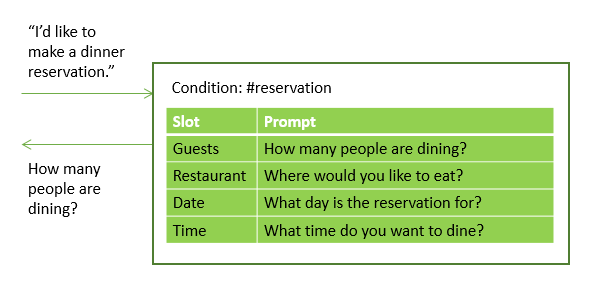

The user might provide values for multiple slots at once. For example, the input might include the information, "_There will be 6 of us dining at 7 PM._" This one input contains two of the missing required values: the _number of guests_ and _time of the reservation_. The service recognises and stores both of them, each one in its corresponding slot. It then displays the prompt that is associated with the next empty slot.

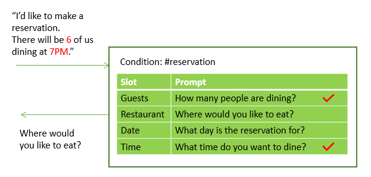

**(1)** We are going to extend our existing Watson Assistant workspace, but first we need to make a copy of it, as we will be using this simpler version later, in [Cognitive Lab 3](../3-Discovery). Make a copy by selecting `Duplicate` from the Workspaces menu, call the new copy `Phone Advisor v1.0` or something similar, and then continue to work with your original workspace.

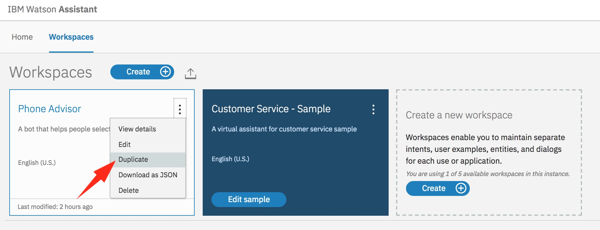

**(2)** Our chatbot is going to use _Slots_ to help guide the user to the most appropriate new mobile phone contract for them (based on some data collected about existing usage), so next we need to create a new `intent` that recognises when the user is looking for a new contract. Add a `newcontract` intent to your workspace now ... something like this should do it ...

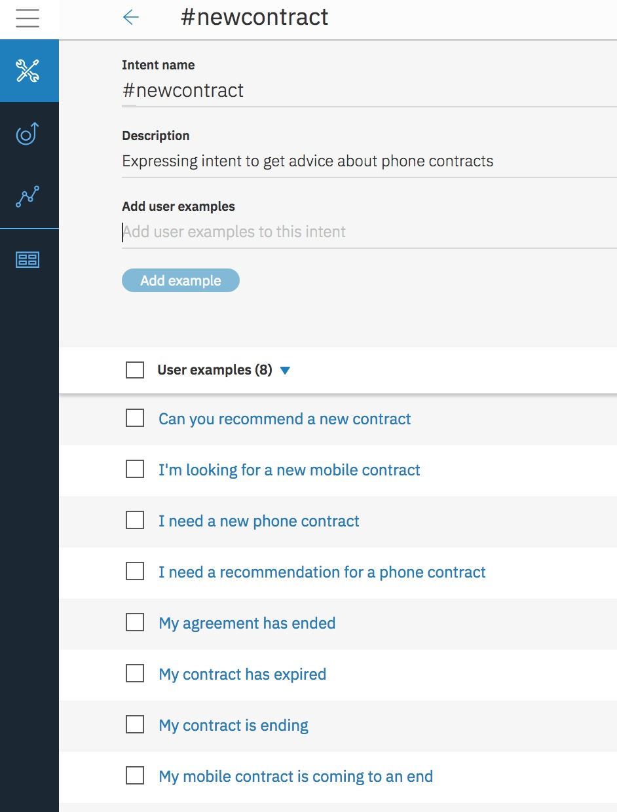

**(3)** In order to search for the best deal, we are going to collect three pieces of information: current **spend**, current **data usage**, and **when** the user would like the new contract to start.

Watson Assistant can provide us with some help here, by automatically looking for any `System Entities` we might want to collect. In your Watson Assistant workspace, go to `Entities`, `System Entities`, and turn on those that we need here: `sys-currency` (for spend), `sys-number` (for data usage) and `sys-date` (for new contract date).

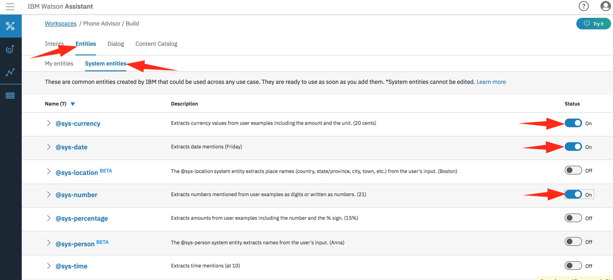

**(4)** Now add a new `dialog` node under the `New phone` node by clicking the three dots and selecting `Add node below`:

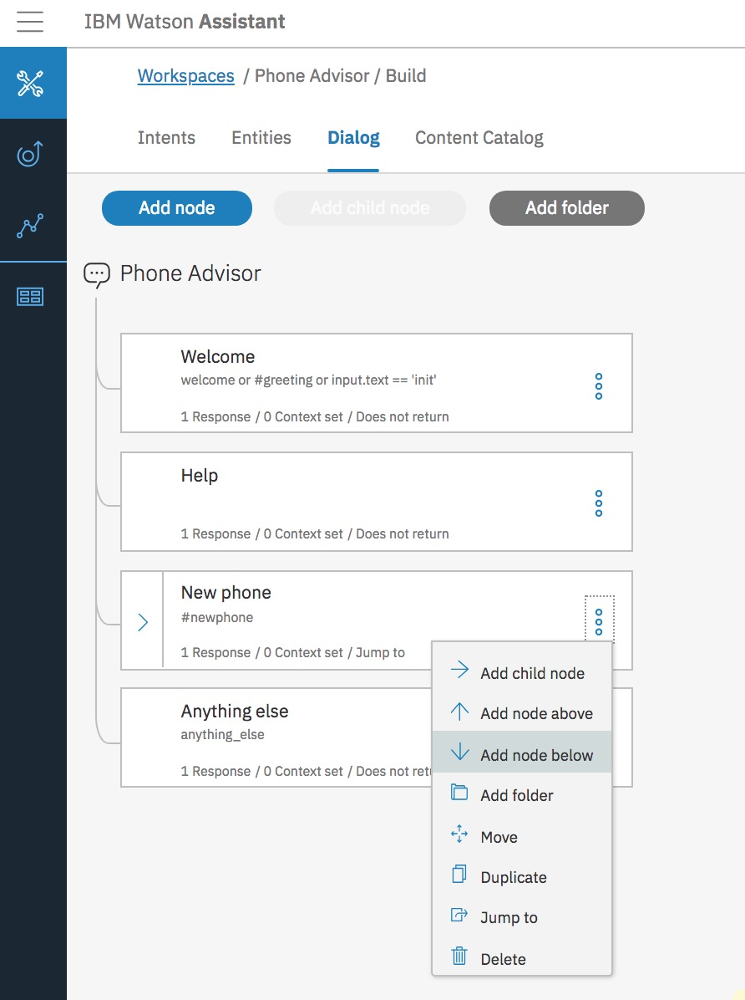

**(5)** Call your new dialog node `New contract`, and ensure it is called when your `#newcontract` intent is recognised. At this point, you should hit the `Customize` button ...


... and then ensure `Slots` and `Multiple Responses` are set to `On`:

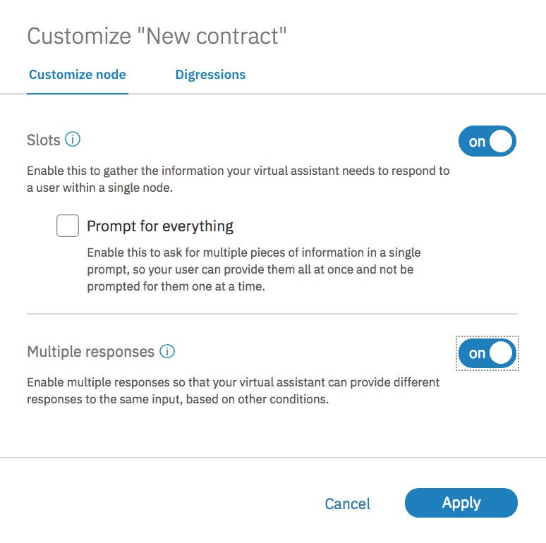

**(6)** Configure your dialog node to ensure you collect the three pieces of information required and a response, like so:  

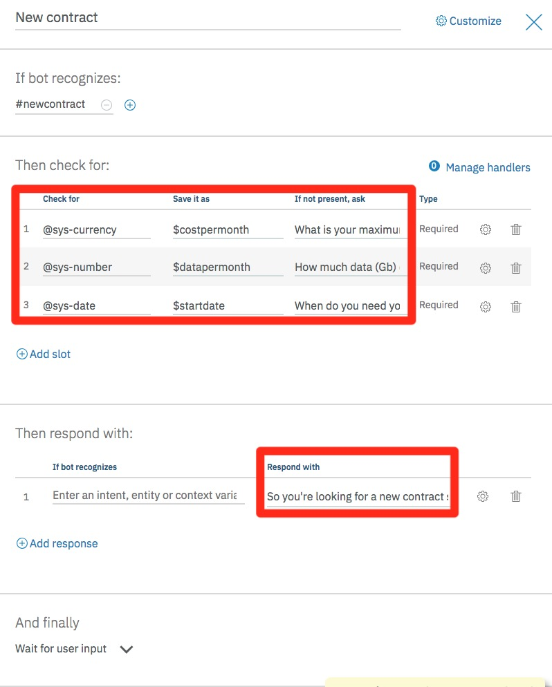

**(7)** If Watson Assistant finds currency (e.g. £20) as input, it adds it to the `$costpermonth` context variable. Similarly, a number will go to `$datapermonth`, and a date to `$startdate`. If these are not found initially, it will use the `If Not Present, Ask` prompts to ensure they are completed.

The `If not present, ask` fields for each slot should contain something like:

- _What is your maximum spend per month?_ for $costpermonth slot
- _How much data (Gb) do you typically use per month?_ for $datapermonth slot
- _When do you need your new contract to start?_ for $startdate slot

**(8)** When all of the slots are full, note that we respond with a confirmation message that includes the context variables:
```
So you're looking for a new contract starting $startdate, with at least $datapermonth Gb
of data per month, costing no more than £$costpermonth each month.
```
Make sure you've added this text to the `Then respond with` field.

**(9)** Use the Testing dialog to see how this works.  If you don't enter any details on the original request, you should get three prompts:                                

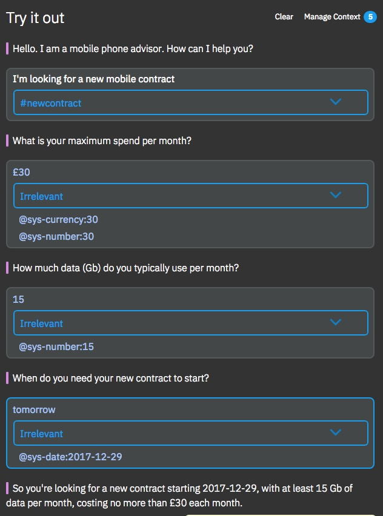

**(10)** If you enter a date as part of your request, then Watson Assistant realises that only the spend and data usage slots still need to be collected:

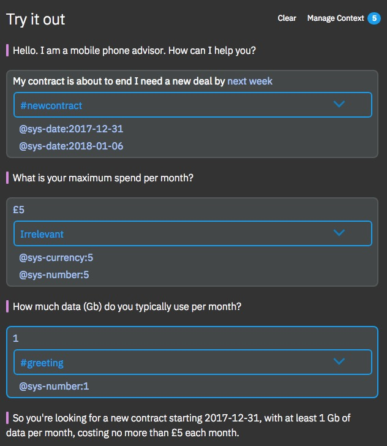

**(11)** Note that the `sys-date` entity doesn't have to be in a specific format.  Watson Assistant will also pick up entities like 'now', 'tomorrow', 'next month', etc.

**(12)** Now expand your `New Contract` dialog branch by adding the following child nodes:
  - `High Tier`: called when $datapermonth > 10 and $costpermonth > 20
  - `Mid Tier`: called when $datapermonth > 5 and $costpermonth > 10
  - `Low Tier`: called when $datapermonth > 0 and $costpermonth > 0
  - `Got Nothing`: called `If bot recognizes` `anything_else` ... a catch all node

**(13)** Each node should present a response that proposes a suitable new contract, something like:

  - `High Tier`: _Your best package currently is BT Unlimited Data, for £24.99 per month._
  - `Mid Tier`: _The best value package for that amount of data is with EE for 8Gb data at £17.99._
  - `Low Tier`: _The best low cost, low data package is currently with Vodafone: 3Gb data for £10 per month._
  - `Got Nothing`: _Sorry, I can't find a suitable package with those requirements!_

**(14)** Here's an example for `High Tier`. Note that each of the child nodes should perform a `Jump To "Help" (Response)` ... this is so that we can then ask the user if they would like any more help, after completing our `New contract` dialog.

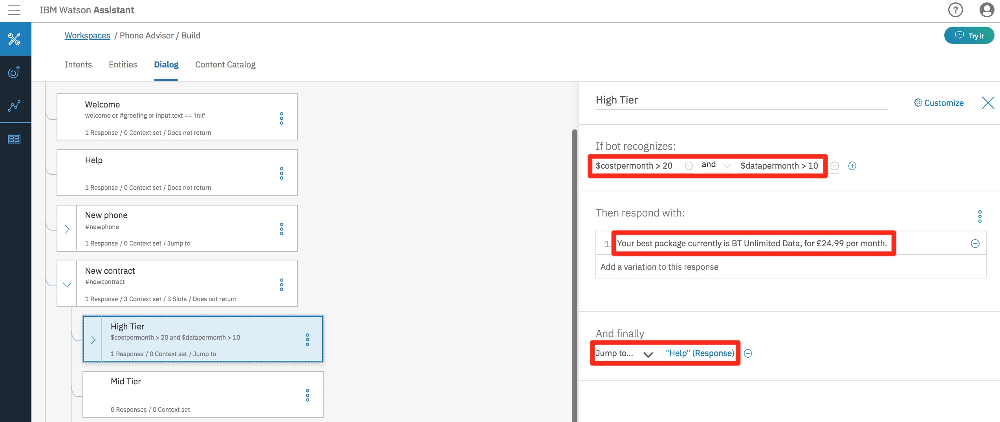

Create each of the four child nodes using this template and the instructions from **(12)** and **(13)**.

**(15)** You should now go back to your `New Contract` node and edit the `And finally` option so that when we drop out of slot gathering we `Skip user input` and immediately perform the tests on the collected data:

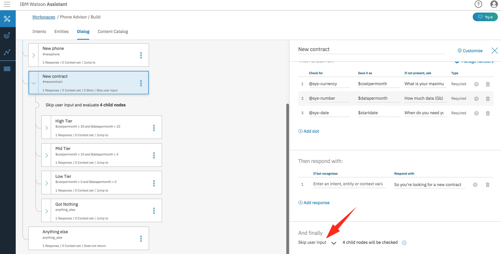

**(16)** Finally, we need to edit **each of these four child nodes** and create another `context variable`, which our Node-RED flow will use as a flag to reinitialise all of our other context variables once we've completed the `New contract` dialog - essentially allowing us to start over with blank slots. We do this by using the `context editor` within each node:

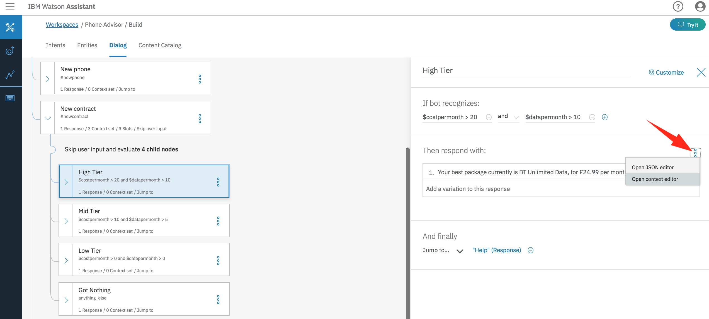

**(17)** In the context editor add the variable `$contractstatus` with a value `found`:

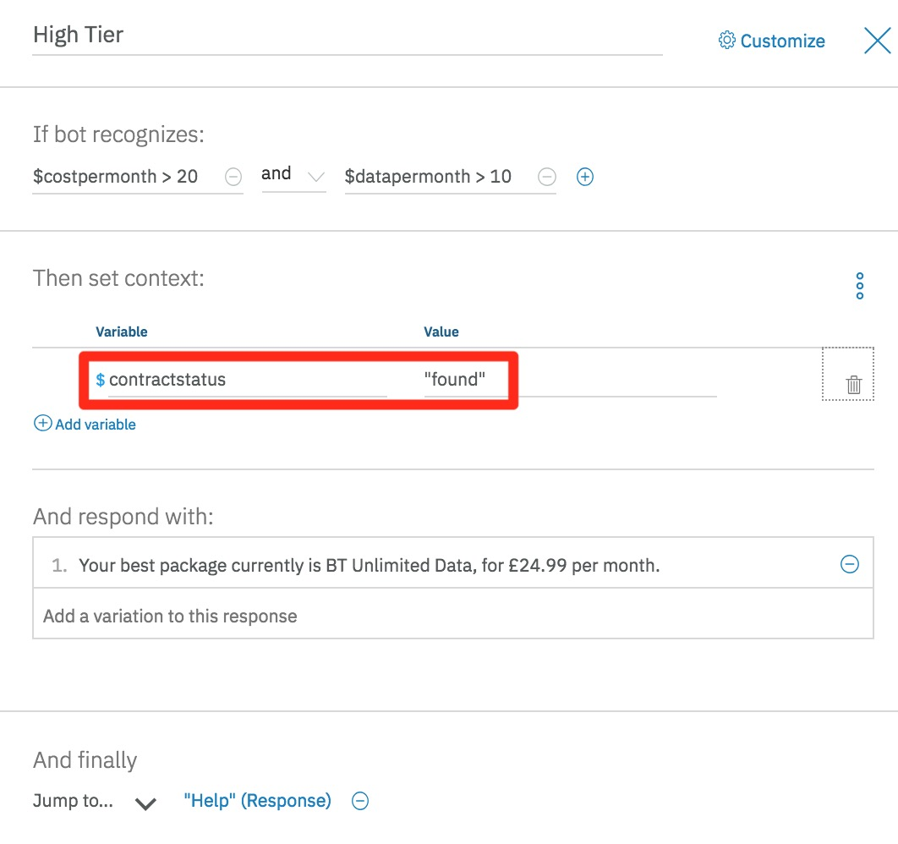

Remember, you need to do this in all four child nodes of the `New contract` dialog.

**(18)** Almost all of the work for this dialog has been done within Watson Assistant. In order to make this work via our Slack chatbot, all we have to do is deal with the context variables in Node-RED, by resetting them once the `New contract` dialog is complete.  In your existing Node-RED Slack chatbot flow, add the following code **at the top** of the existing `Postprocessing` node and deploy the flow:
```javascript
// Reset context variables when New Contract conversation complete
if (msg.payload.context.contractstatus == 'found') {
    msg.payload.context.costpermonth = null;
    msg.payload.context.datapermonth = null;
    msg.payload.context.startdate = null;
    msg.payload.context.contractstatus = null;
}
```
Watson Assistant context variables are passed through to Node-RED via the `msg.payload.context` object as you can see above. This bit of code simply resets our 'slots' and the `contractstatus` variable to `null` so the user can initiate the same dialog again if they want.

**(19)** Here's an example of how this should now look in Slack:

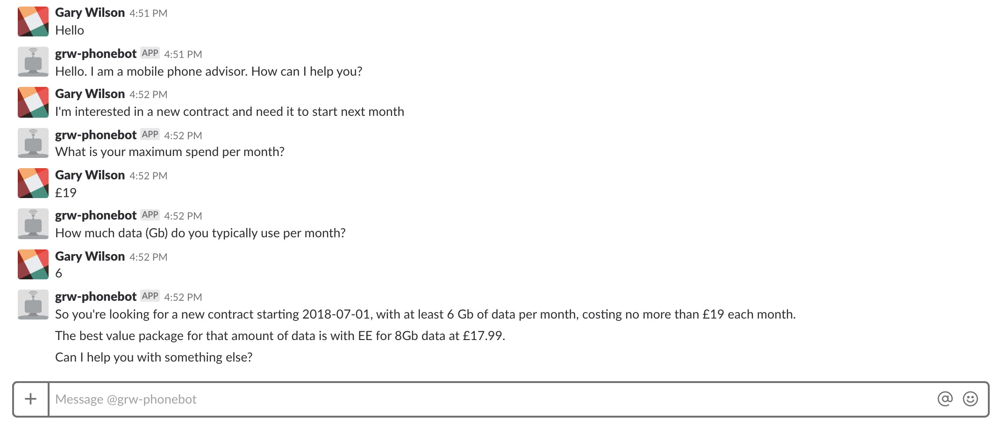

**(20)** Again, if you are having issues it's worth adding `Debug` nodes to your flow. As an example, these are the debug messages output directly from the Assistant node. They show the slot variables being built up, and also the `contractstatus` being set to 'found' when all slots are filled. Once that is triggered, you can see all of the variables then being reinitialised.


## Part 2: Natural Language Understanding (NLU)
Next we are going to add sentiment analysis of user responses to our chatbot, using **Watson Natural Language Understanding (NLU)**. We'll do this by building another intent, that allows the user to submit a review of a mobile phone. When we see this intent, we'll ask for the phone brand and the review text, feed this through Watson NLU to check the sentiment, and return a response based on the positivity/negativity of the review.

**(1)**	First create a NLU instance in IBM Cloud, if you don't already have one.

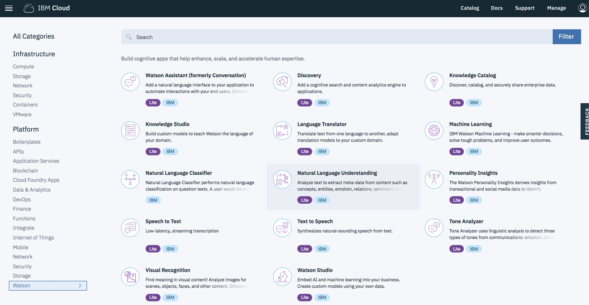

**(2)** When created, connect it to your Node-RED application and restage it, as you did with the Watson Assistant service during the first lab:


**(3)** First let's create a simple connection to the service and test its output. Drag and drop from the left panel `inject`, `debug` and `Natural Language Understanding` nodes and connect them together.


**(4)** Double click the `Natural Language Understanding` node to configure it. Ensure the __Document Sentiment__ and __Entities__ fields are checked.      

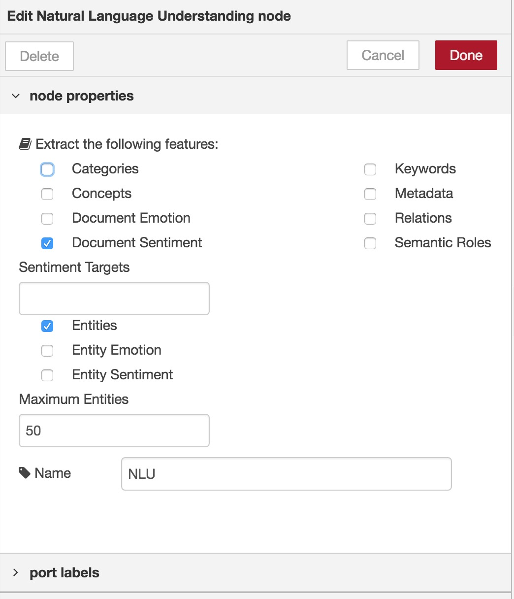

**(5)** Now double click the `inject` node, change the payload type to string, and enter some text that contains clear sentiment and at least one entity, e.g. '_Lisbon is a magnificent city_'.       

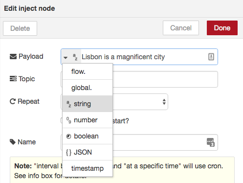

**(6)** Lastly double click the `debug` node and change the `Output` parameter to __Complete message object__.

**(7)** Now you can `Deploy`, select the __debug__ tab on the right and click the `inject` node. A new log message should appear in the debug panel. This is the whole JSON object that was received by the `debug` node. If you click the small arrow next to it to expand its attributes, you should see the analysed entity and sentiment as below.      

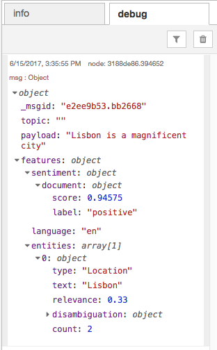

**(8)** Now we can build our new 'review' `intent` and `dialog` in Watson Assistant. Create an `intent` called `#submitreview` with around ten examples of text a user might say to enter this dialog, e.g.
  - Can I submit a review
  - I'd like to review a phone
  - Want to hear what I think of my mobile?
  - Here's a review of my phone
  - Can I give a review of my iPhone
  - Here's what I think of HTC phones
  - I can give you a review of Samsung

**(9)** Now let's create a `Submit review` dialog node below our `New contract` node, which tests for our `#submitreview` intent. `Customize` this node so that it uses `slots`, and that it captures just one slot:
  - _Check for:_ `@brand`
  - _Save it as_: `$brandreview`
  - _If not present, ask_: `Which mobile phone brand do you wish to submit a review for?`

This will allow us to catch the brand the user wants to review if they state it as part of the `#submitreview` intent. By saving the `@brand` as `$brandreview`, we can use it in Node-RED as well as within Watson Assistant - we'll do both!

We should _Then respond with_ `Please submit your $brandreview review now, ensuring you enter more than 15 characters.` and _Finally_ `Wait for user input`.

  - Note, NLU needs at least 15 characters as input, or it will throw an error. You could add a check for this when you've completed this lab if you want an additional challenge!

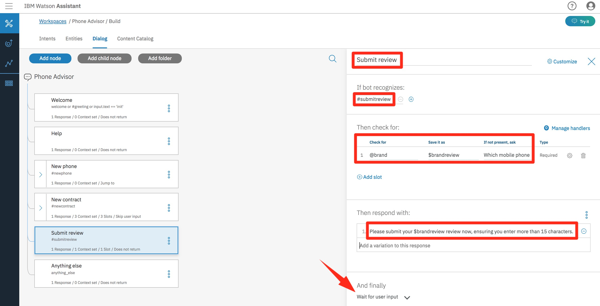

**(10)** Next we need to create a child node to capture the review text, so we can pass it via our Node-RED flow and onto NLU for processing. Call this child node `Analyse review`, and ensure it always runs by testing for `If bot recognizes true`. We don't add a response here, as we are going to build one in Node-RED based on the NLU analysis, but we should ensure we `Jump to Help (Response)`.

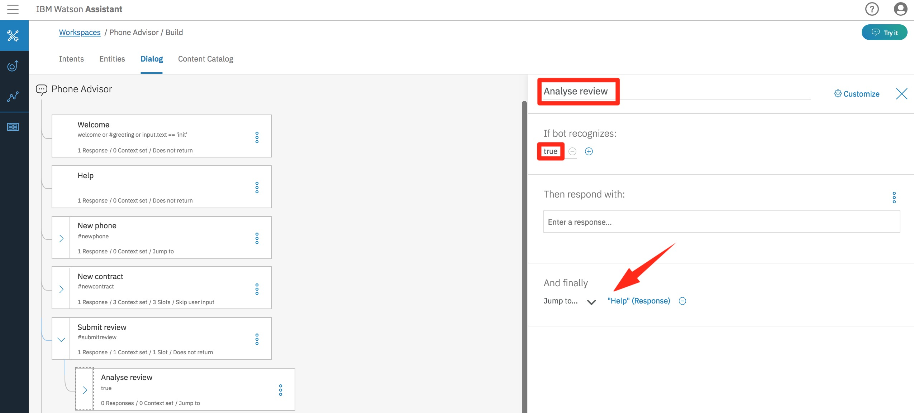

**(11)** What we also need to do in this node, is enter the `context editor` and add a new context variable `action`, and set it to "**review**". This will be our signal to Node-RED to take the user input and pass it through to NLU for processing and building our response.

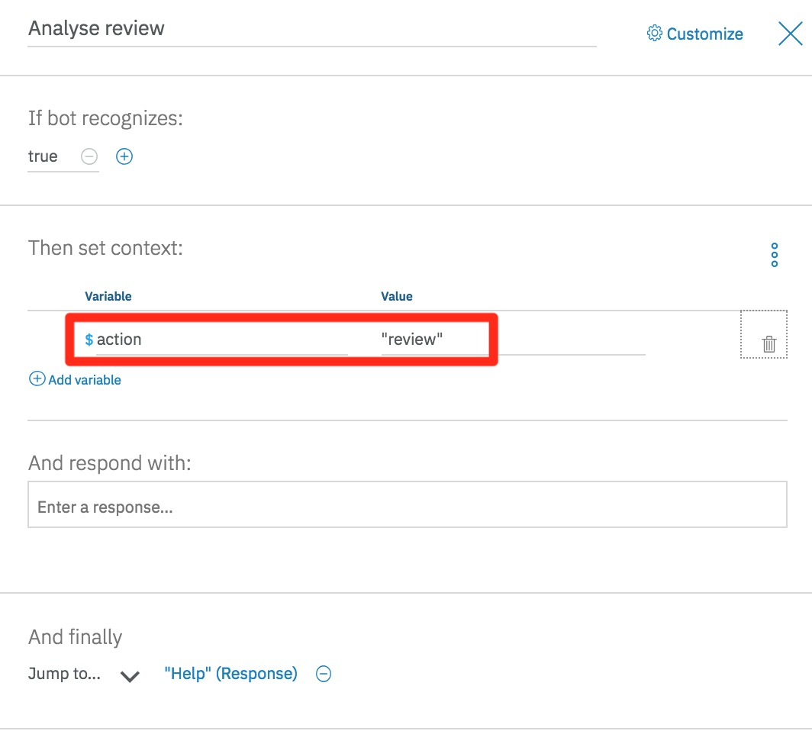

**(12)** Now to the Node-RED flow! Go to your existing Slack chatbot flow, add a `switch` node, a `change` node (that we'll name `Update Payload`) and an `NLU` node, and sever the existing connection between the `Assistant` and `Postprocessing` nodes, like so:


**(13)** Configure the `switch` node to have two outputs. Checking against property `msg.payload.context.action`, route to the first output if it evaluates to string "**review**", otherwise route to a second output. This is the context variable called `action` we just set up in Watson Assistant - we're using it to send any review text to NLU for processing. Other intents will route as before.

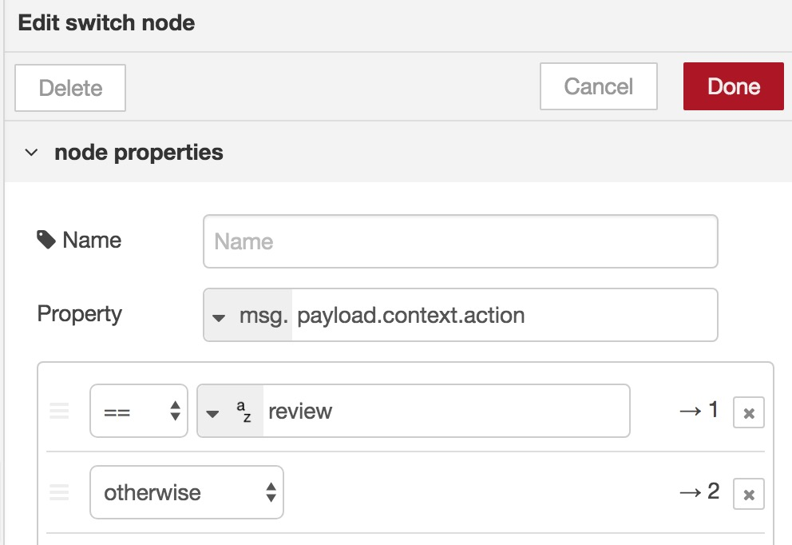

**(14)** Edit the `change` node as below. This saves the `brandreview` context variable into `msg.brand` for later use, and copies the review text which is held in `msg.payload.input.text` when exiting the Assistant node to `msg.payload`, where the NLU node is expecting it as input.


**(15)** The `NLU` node should have the __Document Sentiment__ and __Entities__ fields checked as before.

**(16)** Next add two additional `function` nodes, and a `delay` node.

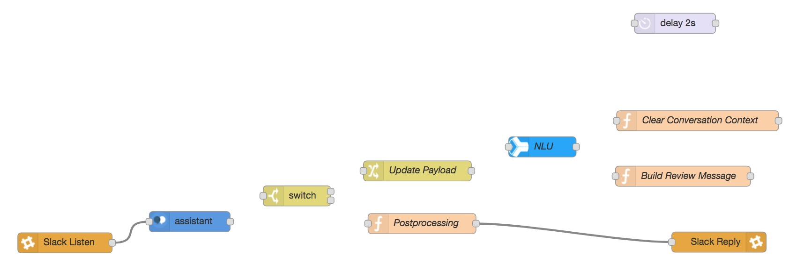

**(17)** The `Build Review Message` function node takes the NLU sentiment score for the review text - passed from the NLU node in `msg.features.sentiment.document.score` - and builds a response based on the score and the brand name saved previously. The scale for the sentiment score is -1 (completely negative), through 0 (ambivalent), up to +1 (completely positive).

Use this code in the function node as a template, and customise the messages and score values as you see fit:
```javascript
// Retrieve NLU score for review
var score = msg.features.sentiment.document.score;

// Build part one of response containing sentiment score
if (score >= 0) {
    var sentiment = "positive";
}
else {
    var sentiment = "negative";
}
absScore = Math.abs(score);
var outputA = "Watson calculates your " + msg.brand + " review to be " + Math.round(absScore * 100) + "% "+ sentiment + ". ";

// Build part two of response
switch (true) {
  case score > 0.7:
    var outputB = "A big fan then, I see!";
    break;
  case score > 0.2:
    var outputB = "I guess you think " + msg.brand + " phones are mostly OK.";
    break;
  case score > -0.2:
    var outputB = "You sound pretty ambivalent about " + msg.brand + " products.";
    break;
  case score > -0.7:
    var outputB = "OK so you definitely don't like " + msg.brand + " phones. Time for a change!";
    break;
  default:
    var outputB = "Clearly not a fan, at all.";
}

// Send consolidated message to Slack
msg.payload = outputA + outputB;
node.send(msg);

return ;
```

**(18)** The `Clear Conversation Context` function node does just what it says - reinitialising all context so that Watson Assistant can start over. Add this code to the function node.

```javascript
msg.payload = "hi";
msg.params = {
    context : {}
}
return msg;
```

**(19)** The `delay` node is the other piece of this puzzle. After we send the NLU-based response we need to wait a short time before sending the instruction to Watson Assistant to reset the dialog - this is so we get the messages in the right order!

Edit the `delay` node properties so that we wait for just 2 seconds - this should be plenty of time.

**(20)** Finally, wire the nodes together as below and `Deploy` your flow.

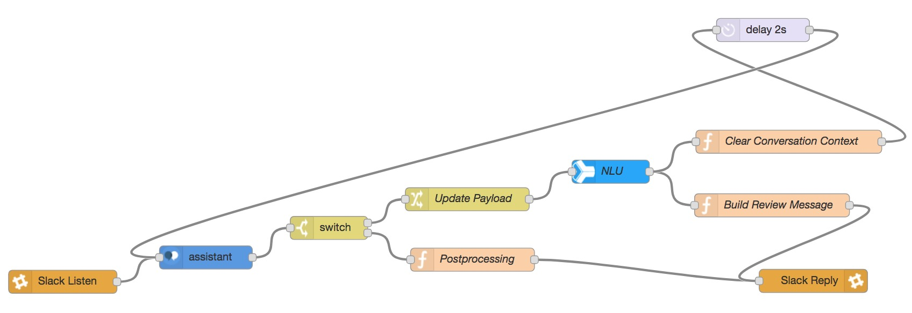

**(21)** This Slack chatbot dialog should then look something like this:

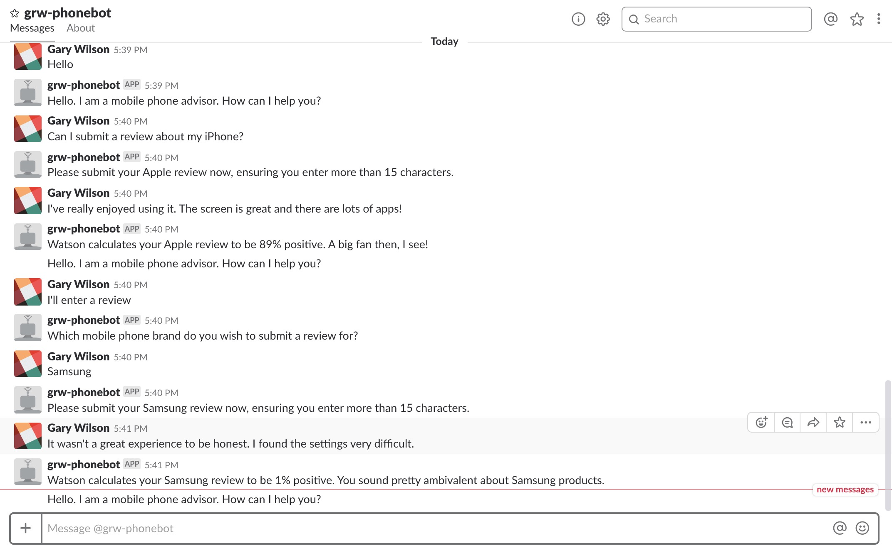

You've reached the end of the Enhancing Chatbots lab! Your chatbot has been extended using `slots`, `context variables` and `natural language understanding`.

If you want to download the complete Watson Assistant workspace you can do so [here](./Assistant/workspace_final.json), and the Node-RED flow can be found [here](./Node-RED/final.json).

Now go to [Cognitive Lab 3](../3-Discovery) to build long-tail responses into your chatbot!
