# Cognitive Lab 3: Extending Chatbots with Watson Discovery
This lab will focus on extending your simple chatbot to handle long tail conversations, by using the **Watson Discovery** service. We'll also make use of another 3rd party chat service called _Telegram_.

## Requirements
- Successful completion of [Cognitive Lab 2](../2-Extended).

## Agenda:
- setup Telegram chatbot interface
- setup Discovery Service instance
- setup Discovery document collection
- build Discovery Q&A repository
- setup Node-RED orchestration application
- query Discovery through Bot
- connect Discovery and Watson Assistant

## Set up Telegram chatbot interface
This lab builds on the simple Watson Assistant workspace created in [Cognitive Lab 1](../1-Basics), and uses the Telegram messaging interface.  The first thing we need to do therefore, is set up a new Telegram chatbot.

**(1)** If you haven't used Telegram before, download the app to your phone:

  - Android:  https://play.google.com/store/apps/details?id=org.telegram.messenger
  - iOS:  https://itunes.apple.com/app/telegram-messenger/id686449807

**(2)** Once you've successfully signed up, you can either continue to use Telegram via the app, or you can also use the Telegram web interface [here](https://web.telegram.org).

**(3)** Use the search bar in the app to find **@botfather**:

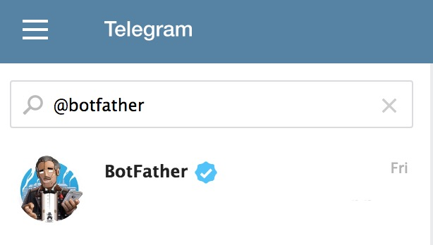

**(4)** **@botfather** helps you create and manage Telegram bots. Send the message `/newbot` to @botfather.

**(5)** Follow the prompts to enter a name and username for your new bot, and then save the generated API token - you'll need this in your Node-RED flow shortly.


**(6)** Note that you can configure your bots at any time by using the `/mybots` command with @botfather, including retrieving your API key if you misplace it.

**(7)** Now you have your Telegram bot, we'll set up Node-RED so it works with the simple conversation we created in [Cognitive Lab 1](../1-Basics). Go to your Node-RED editor and add in the Telegram nodes via `Manage Palette`. You should install the `node-red-contrib-telegrambot` package.


**(8)** The flow for using Telegram as our chatbot UI is pretty similar to the one you created for Slack, with a minor tweak to cater for the way that the nodes handle getting responses routed to the right user. Download the code from [here](./Node-RED/basic-flow-telegram.json), copy all of the contents of the JSON file to the clipboard, and import it to Node-RED via the `burger` icon at the top right of your Node-RED editor, `Import`, `Clipboard`.


**(9)** Double-click the `Telegram Command` node on the left and then click the pencil to add your bot name and API token.

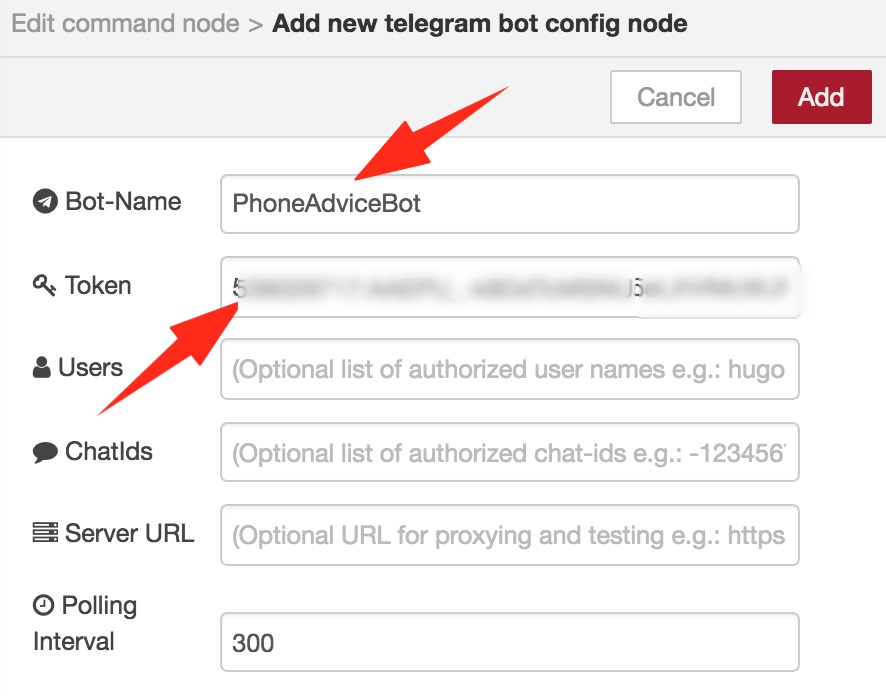

Ensure the `Command` field is left blank.

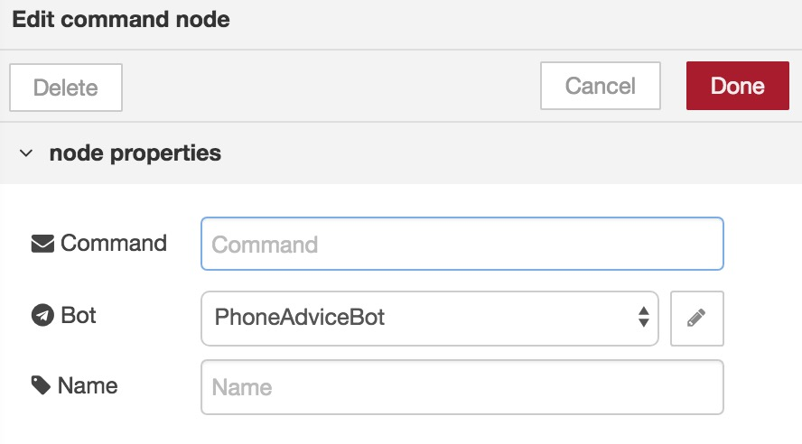

**(10)** Change the `assistant` node to use the `Workspace ID` of the Watson Assistant workspace you made a backup copy of at the start of [Cognitive Lab 2](../2-Extended) - we suggested calling it `Phone Advisor 1.0`. Finally, edit the `Telegram Sender` node to point to your bot, and `Deploy` the flow.

**(11)** Go to Telegram on the [web](https://web.telegram.org/) or on your mobile app, and add your new bot by typing the name into search bar, and then selecting it. Hit the `Start` button if you see one.


**(12)** Test your new bot!

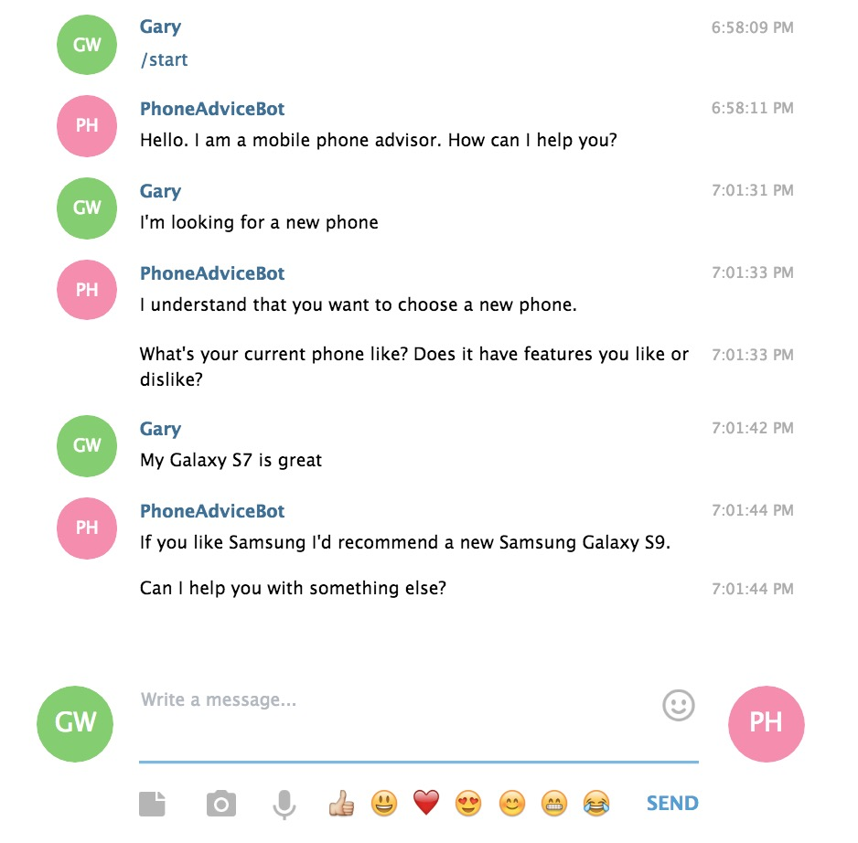

## Setting up the Discovery Service
In this section we are going to setup the Discovery service, create a custom collection containing potential long-tail questions and answers - information that might help a mobile phone user answer a specific question or fix a problem - upload the dataset and test a query.

**(1)** Create a `Watson Discovery` service in IBM Cloud (use the `Lite` plan if you are using your personal IBM Cloud ID, or `Standard` if you are using a linked account).

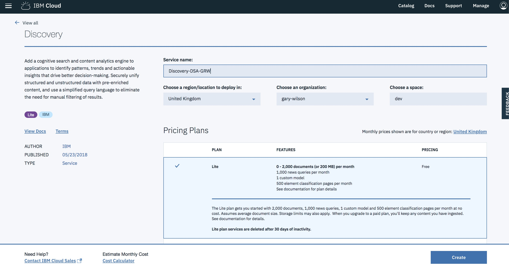

`Connect` this new service to your existing Node-RED application - use the same method you used when connecting the Watson Assistant and NLU services - and `restage` it when asked.

**(2)** Launch the Discovery tool from your newly created service. You may see a `Welcome` message or two ... if so click the appropriate buttons to dismiss them, and once in the application, select `Upload your own data`.


**(3)** You may be guided to set up new storage - complete this process if you are by selecting `Continue`. Then give your new data collection a name, use the `Default Configuration` and click `Create`.

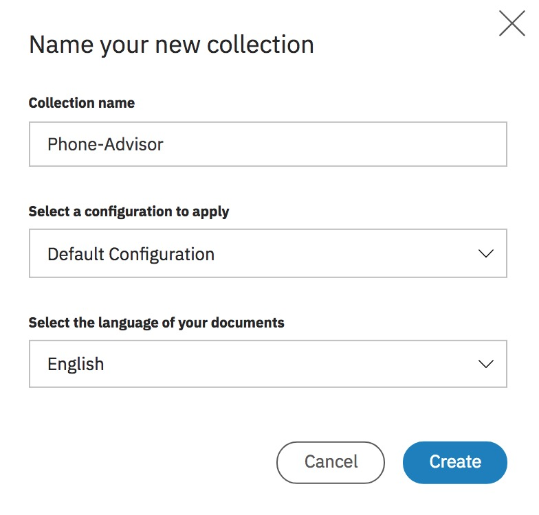

**(4)** Next, we are going to create a custom configuration that enriches our dataset. Click on `Switch`:

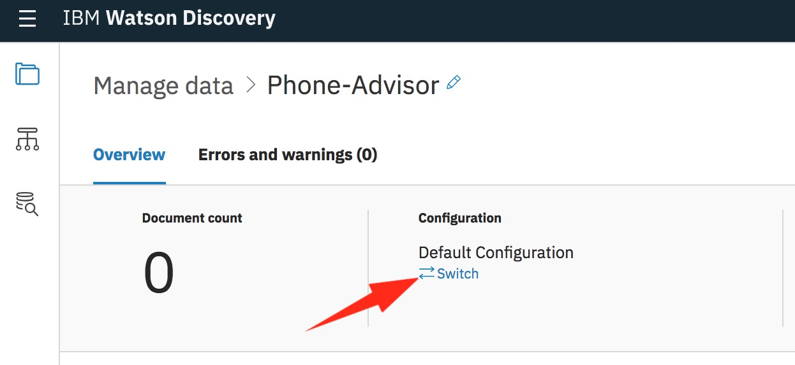

**(5)** Select `Create a new configuration`, give it a name when asked, hit `Create`, and close down the informational message: `Add Sample Documents`.

**(6)** Download, and extract this [dataset](./data/discovery_data.zip) - it contains 1000 Q&A pairs in JSON format that can help our chatbot answer questions about specific mobile phone related issues. Watson Discovery allows you to add content to a collection using _Microsoft Word, PDF, HTML, or JSON documents_.

**(7)** Watson Discovery can enrich (add cognitive metadata to) your ingested documents with semantic information collected by these nine Watson functions - _Entity Extraction, Sentiment Analysis, Category Classification, Concept Tagging, Keyword Extraction, Relation Extraction, Emotion Analysis, Element Classification and Semantic Role Extraction_. We are going to just use **Sentiment Analysis** here, so we can filter out negative sounding responses before our chatbot responds to the user. You can find out more about enrichment [here](https://console.bluemix.net/docs/services/discovery/building.html#adding-enrichments).

**(8)** First, delete all default enrichments and hit `Apply and Save`. Then upload one sample JSON document from the extracted dataset by selecting `or browse from computer` and choosing one of the JSON files.

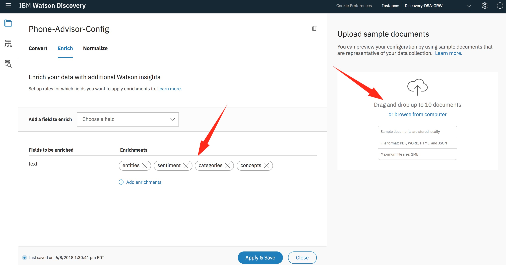


**(9)** Click on the uploaded document and then select the `Add a field to enrich` dropdown, then `Accepted_Answer`.

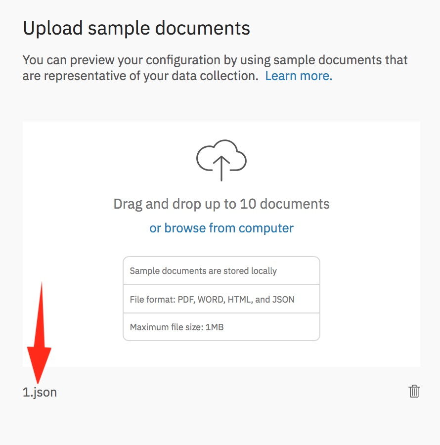

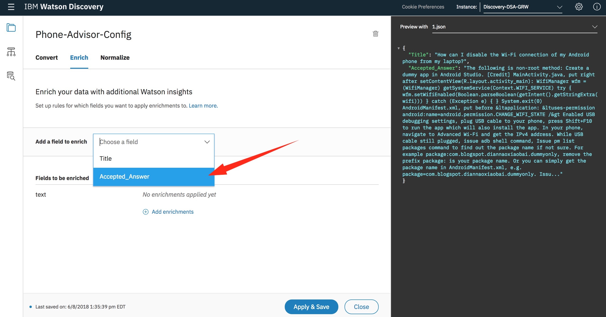

**(10)** For the `Accepted_Answer` field, select `Add Enrichment`, add just `Sentiment Analysis` and hit `Done`. You can see all of the possible enrichments we can apply on this screen. Your config should then look like this:

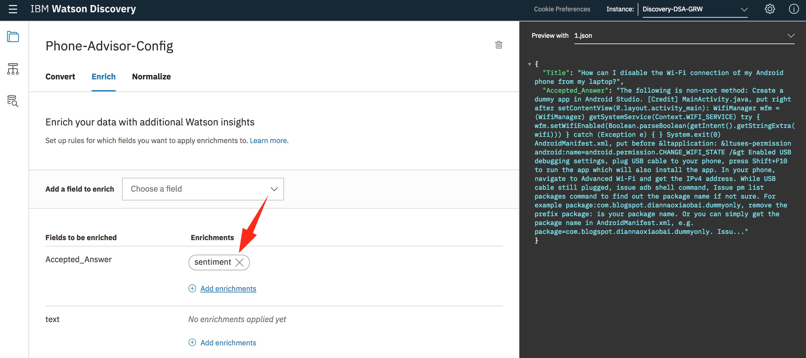

**(11)** Hit `Apply and Save` then `Close`, and go back into your collection.  At this point, we are going to upload all of the documents to create our knowledge base. As we do this Watson Discovery will create the sentiment metadata for the `Accepted_Answer` field within each document.

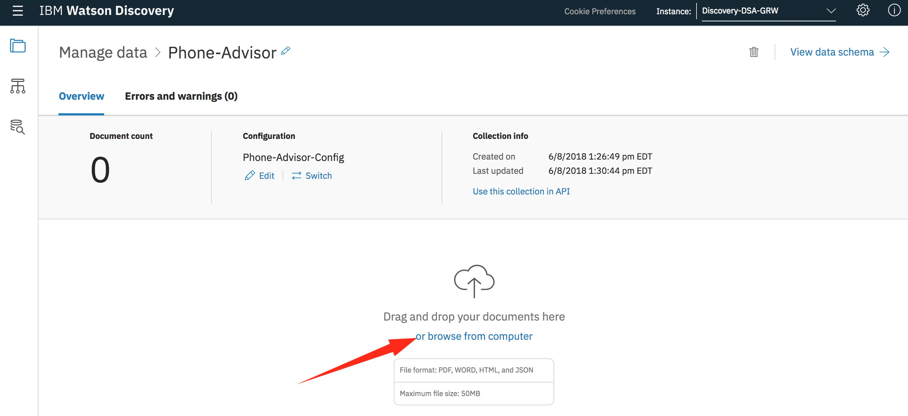

- Drag and drop or browse and select the JSON documents from the previously extracted dataset. There are 999 in total, and as there are limits to how documents you can add in a single transaction when you are using a Lite plan, **we suggest you upload in batches of 100-200 documents at a time**.

- Watson Discovery will start to upload and process the files as you add them ... it will take a few minutes! You will see the `Document` count increase and the `General Sentiment` values change as Watson Discovery processes each of the files.

  

- Whilst on this screen select `Use this collection in API` and make a note of `Environment ID` and `Collection ID` as we'll need them in our Node-RED flow.

  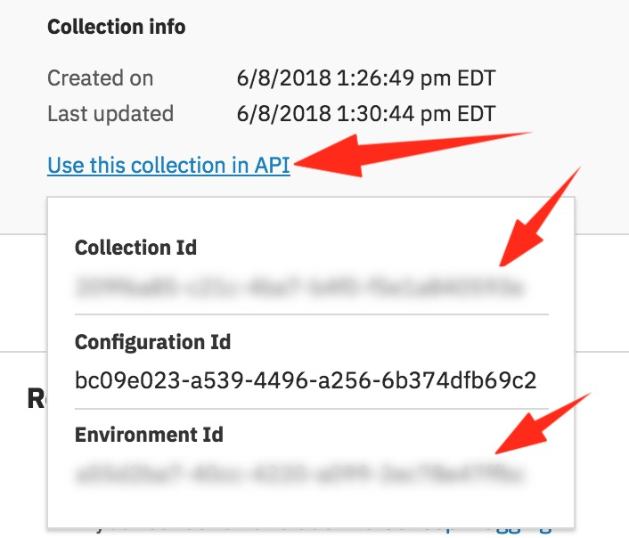

**(12)** When you've added all of the documents, you can query the collection even whilst uploading and processing is still ongoing, by clicking on the `Build Query` icon  on the left side of the screen.

**(13)** If you select the `Run query` icon at the bottom of the screen you will see a selection of the documents in the collection that have been uploaded so far. Select the curly brackets next to one of the `enriched_Accepted_Answer` fields to see the sentiment score Watson Discovery has applied to the document.

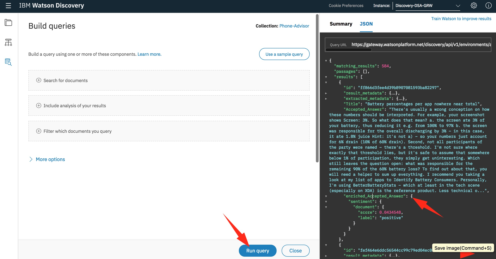

**(14)** Next, we are going to make use of our enrichment by filtering out answers that have negative sentiment. Using `Filter which documents you query`, select:

  - Field: `enriched_Accepted_Answer.sentiment.document.label`
  - Operator: `does not contain`
  - Value: `negative`

At this point also set `Passages` to `No` in `More options`. _Passage Retrieval_ lets you find pieces of information within large documents that are ingested into Watson Discovery, finding relevant snippets of a document based on your query. For developers, Passage Retrieval can reduce the time that it takes to hand-craft data into consumable units of information for conversational chat bots or search and exploration interfaces. In our case, we already have _consumable units_ (Q&A pairs stored in JSON documents), so Passage Retrieval is not required.

If you run this query you will see the answer data is then filtered by positive and neutral responses only.

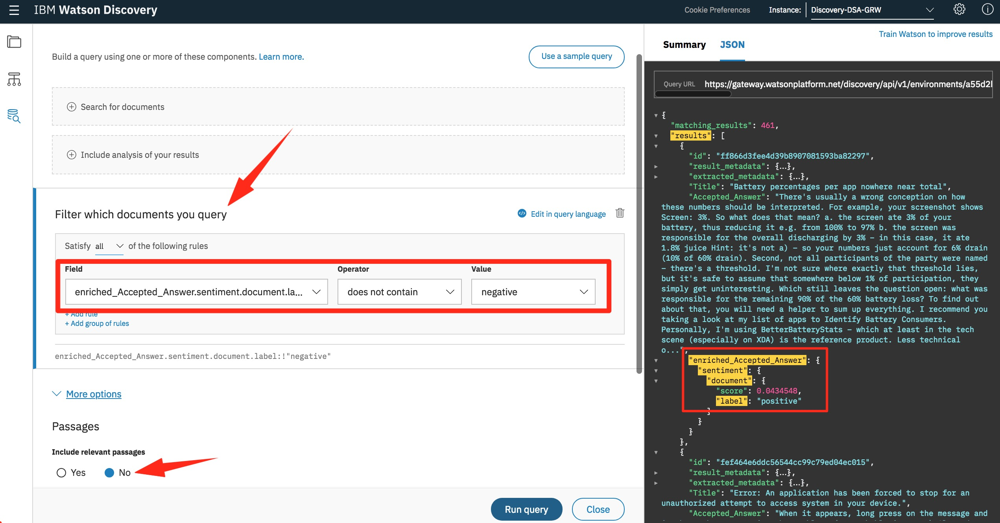

**(15)** You can test a natural language query of the collection by asking a question in `Search for documents`. Discovery will return documents in best match order. Try _"My Nexus 7 can't connect to Mac"_ as shown in the example here.

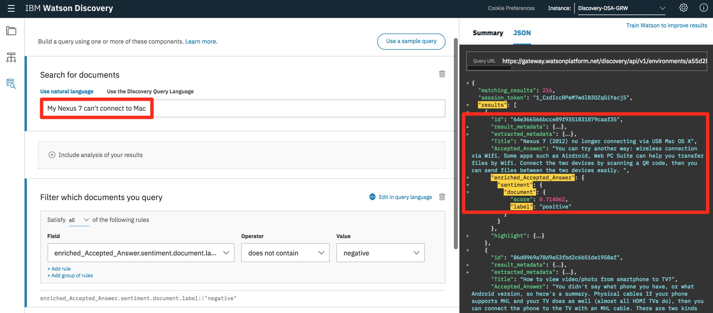

**(16)** For more on building queries, have a look at the tutorial [here](https://console.bluemix.net/docs/services/discovery/getting-started-query.html#getting-started-with-querying).

**(17)** When Watson Discovery has processed all the documents, we can now test the service in a Node-RED application, and incorporate it into our Telegram chatbot.

## Querying the Discovery through our Telegram chatbot
**(1)** In the previously imported Telegram Node-RED flow add a new `function` node called `Prepare for Discovery` with the following code:
```javascript
msg.chatId = msg.payload.chatId;
msg.discoveryparams = {};
msg.discoveryparams.query = msg.payload.content;
return msg;
```
This handles the Telegram chat interface, and sets the query to be passed to Watson Discovery (expected in `msg.discoveryparams.query)` to be whatever has been entered by the user via the chatbot (received in `msg.payload.content`), e.g. _"My Nexus 7 can't connect to Mac"_.

**(2)** Add a `discovery` node and double-click to configure it. Set the Method to `Search in collection`.

**(3)** Enter the `Environment ID` and `Collection ID` you noted earlier, set `Number of documents` to `1` and turn-off `Passages`.

**(4)** Into the `Filter for Search` field, copy the filter that we used in our Discovery query earlier: `enriched_Accepted_Answer.sentiment.document.label:!"negative"`


**(5)** Add another function node `Send Discovery Response` that uses the code below. This node pulls out the best matching response from Discovery (returned in the `msg.search_results.results` array) and sends it onto Telegram. `Title` and `Accepted_Answer` are the fields used in the original JSON Q&A pair documents.

Because there are two messages sent back to the user - the original question and the 'best' answer - we are using a `setTimeout` function to delay the sending of the second message slightly, to ensure they arrive in the correct order.

Note that if no matching results are found in Discovery, we send back a "Sorry, please try again" message to the user.
```javascript
var results = msg.search_results.matching_results;
if (results > 0) {
    var question = msg.search_results.results[0].Title;
    var answer = msg.search_results.results[0].Accepted_Answer;

    msg.payload = {
            chatId : msg.chatId,
            type : "message",
            content : "I found this question that is similar to yours: " + question
        };
    node.send(msg);

    // Use setTimeout function to ensure small delay in sending
    // 2nd message to ensure answer arrives after question.

    setTimeout(function (){
        msg.payload = {
                chatId : msg.chatId,
                type : "message",
                content : "And this is the answer: " + answer
            };
        node.send(msg);
    }, 500);
} else {
    msg.payload = {
        chatId : msg.chatId,
        type : "message",
        content : "Sorry, I couldn't find anything to help. Maybe you could try rephrasing your question?"
    };
    node.send(msg);
    return;
}
```

**(6)** Connect the nodes up as shown below, delete the connection between the Telegram and `Prepare for Conversation` nodes (for now), and `Deploy` your flow.


**(7)** The whole flow can be found [here](./Node-RED/flow-1.json).

**(8)** You can test the bot's performance with questions like these:
 - _How do I know my compass is pointing the right way?_
 - _Can I keep reinstalling apps I've bought from the market?_
 - _The GPS on my HTC Desire is not working after upgrading_


## Connecting the short and long tail using Watson Assistant and Discovery
In this section we want to combine the power of the Watson Assistant service with the knowledge of the Discovery service by using them together.

When the user asks a question we are going first send it to Watson Assistant. If the user input matches an intent, with a confidence level of over 80%, we will use the appropriate Watson Assistant response from our dialog tree.

If this is not the case, we'll then send the user input to Watson Discovery and use the best answer from there, if one is returned from a search of our defined collection.

**(1)** We're going to introduce some additional nodes to make this work, so take your existing flow and do the following:
  - Sever the link between the `Telegram Command` node and the `Prepare for Discovery` function node
  - Wire the `Telegram Command` node (2nd output) to the `Prepare for Assistant` function node
  - Delete the link between the `assistant` and `Send Assistant Response` nodes
  - Move the nodes on the workspace so you have a gap to add the additional nodes we will need, so your flow looks something like this:


**(2)** Edit the `Prepare for Assistant` node by replacing the code with this new version:
```javascript
// Save user input for Discovery if needed
flow.set('userInput',msg.payload.content);

// Pass to Watson Assistant
msg.chatId = msg.payload.chatId;
msg.payload = msg.payload.content;

return msg;
```
The only change here is the first line, which saves the user input to a Node-RED `flow variable` so we can use it again later in the flow, passing it to Watson Discovery if needed.

**(3)** Add a new switch node, call it `Test for Found Intent`, and customise it to look like this:  

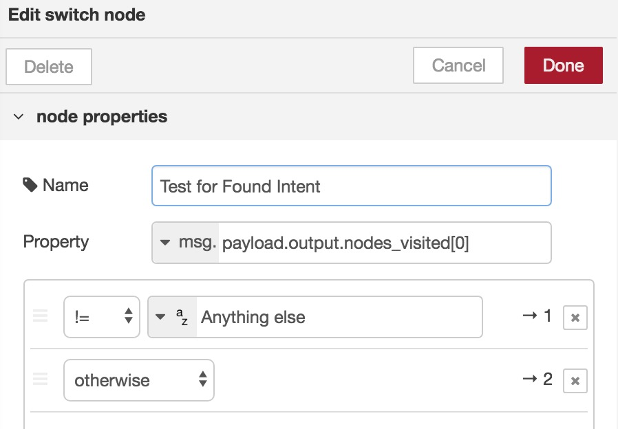

This checks the intents Watson Assistant has matched with the user input. If no intents are matched Watson Assistant will return `Anything else` in `msg.payload.output.nodes_visited[0]`, and if this is the case, we want to then move straight to applying our query to Watson Discovery.

**(4)** Add another new switch node - `Test Intent Confidence Level`. Make it look like this:  

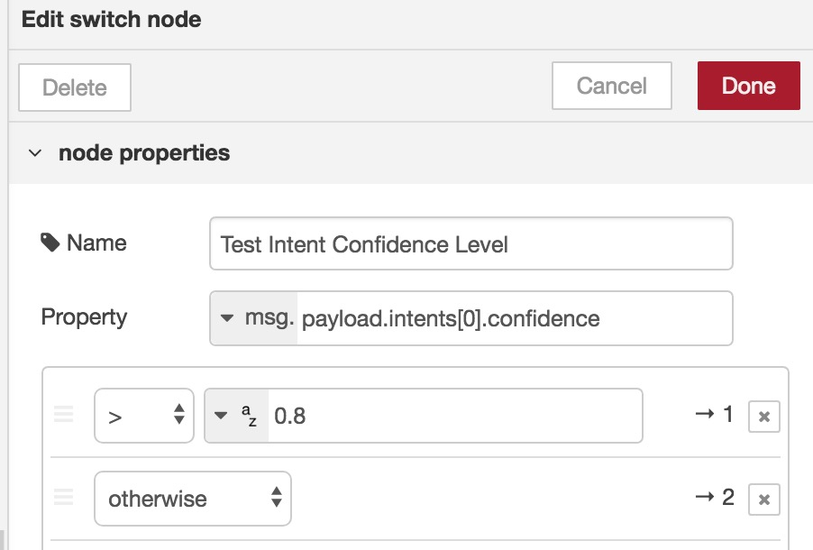

At this point Watson Assistant has matched an `intent`, but we now want to check to make sure it's confident in its decision. 80% is a reasonable level of confidence, so the `switch` node tests for this (using `msg.payload.intents[0].confidence`).

If we do get a high level of confidence in our intent, we'll then send the appropriate Watson Assistant response to Telegram and thus our end user. If not, we'll send the original user input to Watson Discovery.

**(5)** Wire these new `switch` nodes in like so:


**(6)** Next, edit the `Prepare for Discovery` node and replace the code with this:
```javascript
// Get user input to pass to Discovery
msg.discoveryparams = {};
msg.discoveryparams.query = flow.get('userInput');

return msg;
```
Here - having arrived at this point because Watson Assistant couldn't provide us with a confident intent - we are retrieving the user input from the previously saved `flow variable`, and passing it to Watson Discovery so it can try and provide us with a response.

**(7)** Our final task is to get Watson Assistant to produce the _"Can I help you with something else?"_ message and restart the dialog flow, even after it's Discovery that has provided us with the answer to our query.

If you remember, in our Watson Assistant dialog flow, we have a `Help` dialog node, which we `Jump to` within Watson Assistant whenever we've completed a dialog conversation, to get the _"Can I help you..."_ message. There's currently no `intent` for this, but if we create one, add it to the `Help` dialog node, and forcibly call it from our Node-RED flow, we can achieve the same result.

Launch your Watson Assistant instance, and add a basic `#help` intent that just has a single example of `gotohelp`, then add the `#help` intent to the `Help` dialog flow. Make sure you're using the `Phone Advisor 1.0` workspace!

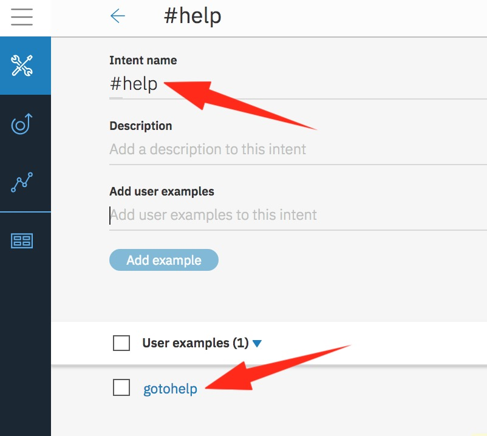


Go back to your Node-RED flow, add another function node, and call it `Send Reset to Assistant`. Copy in the following code, which sends a _"gotohelp"_ message to Watson Assistant. This will invoke the `help` intent and dialog response.
```javascript
msg.payload = "gotohelp";
msg.params = {
    context : {}
};
return msg;
```

Finally, add a `delay` node with a fixed delay of 2 seconds. This will ensure we only get the Watson Assistant welcome message after our Discovery responses have been delivered to the user.

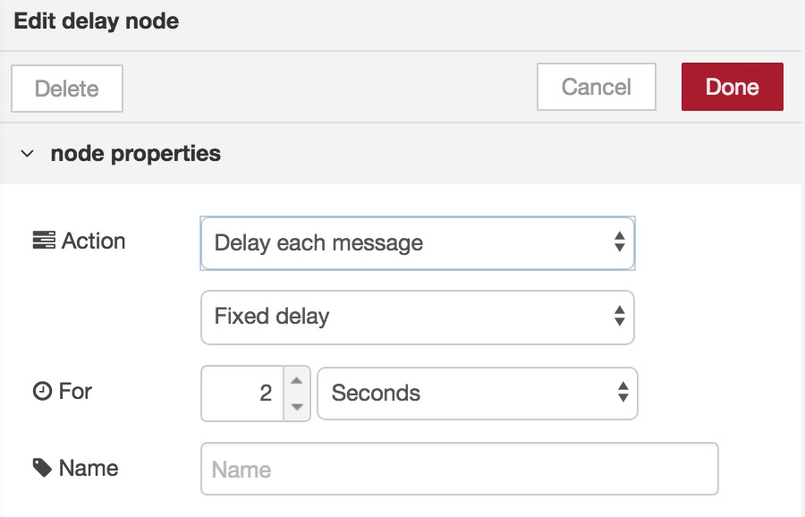

**(8)** Connect these last nodes up as you can see here:


The whole flow can be found [here](./Node-RED/flow-2.json).

**(9)** You can test the bot's performance with user input that can follow either path: e.g.
  - _Need to set Google Now location_ (Discovery)
  - _I want a new phone_ (Assistant)
  - _My S4 is not connecting to Windows_ (Discovery)
  - _Blah blah_ (Neither path works - user should get a "please respecify query" message)

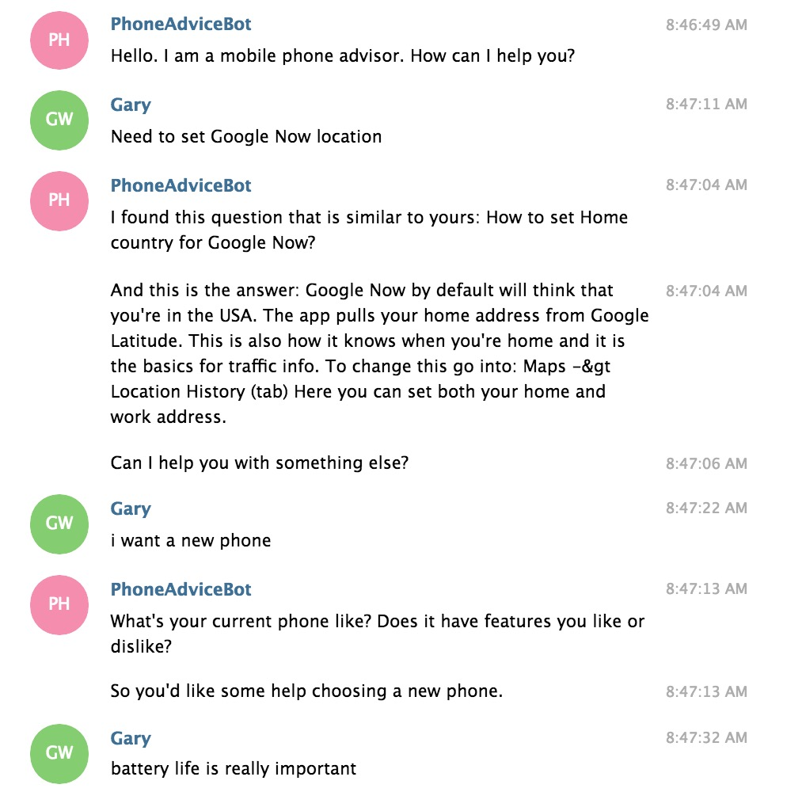
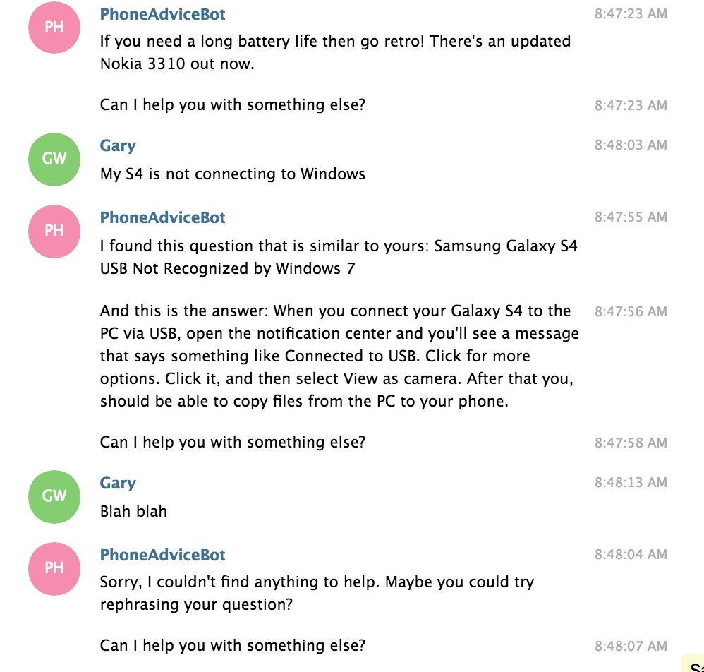

Congratulations! You've extended your chatbot to include long-tail responses using a Watson Discovery collection, and updated your Node-RED application to pick the best response from Watson Assistant and Discovery!

This is the end of Cognitive Lab 3, and also the series of cognitive chatbot labs - why not go and try your luck with [Cognitive Lab 4](../4-Visual)!
