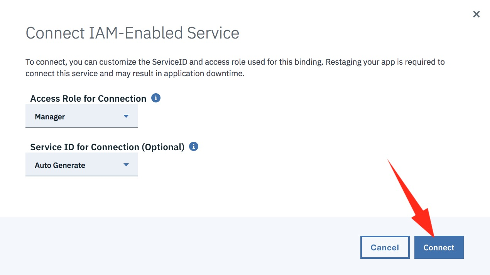
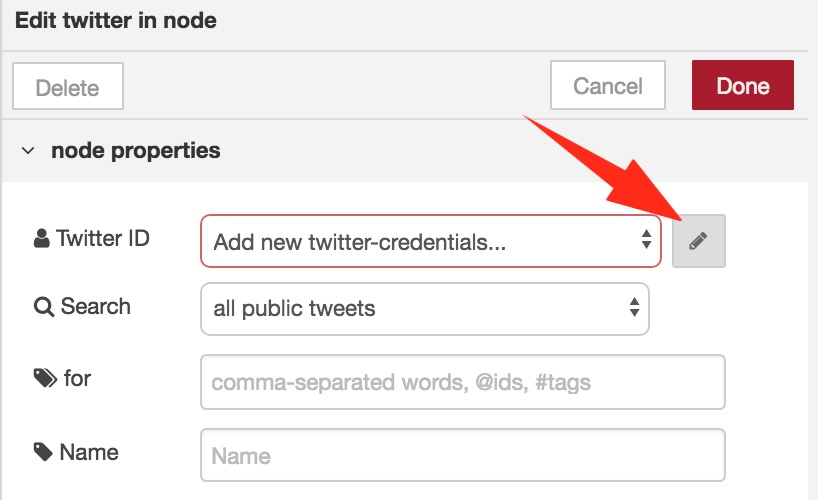
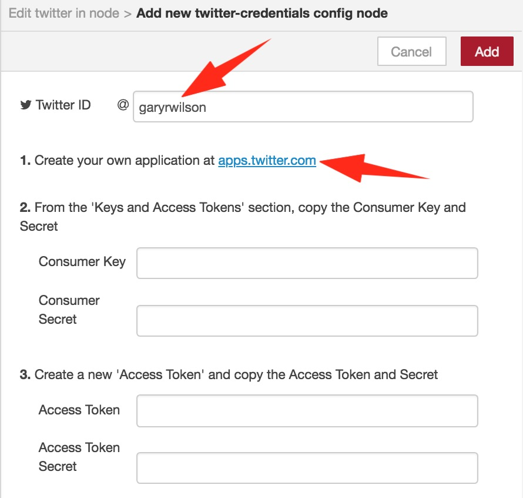
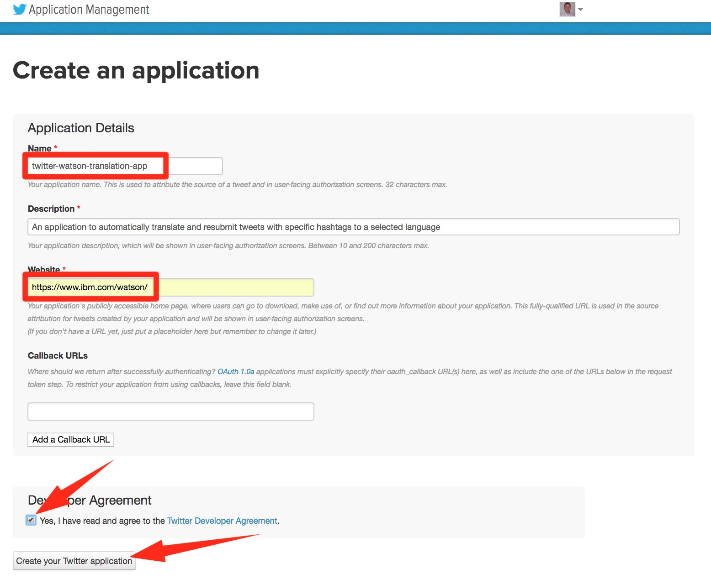
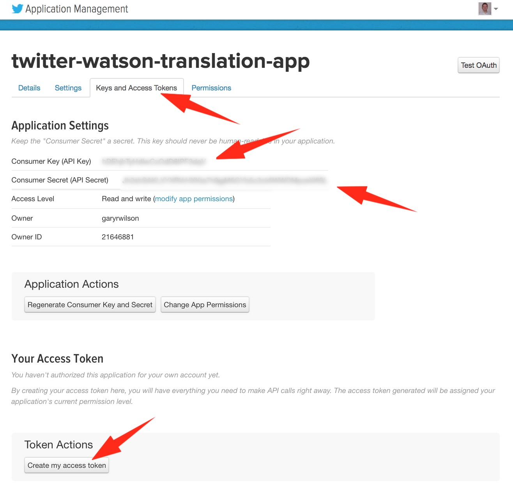
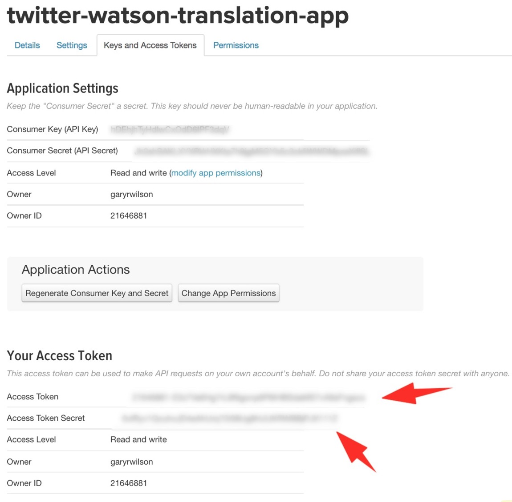
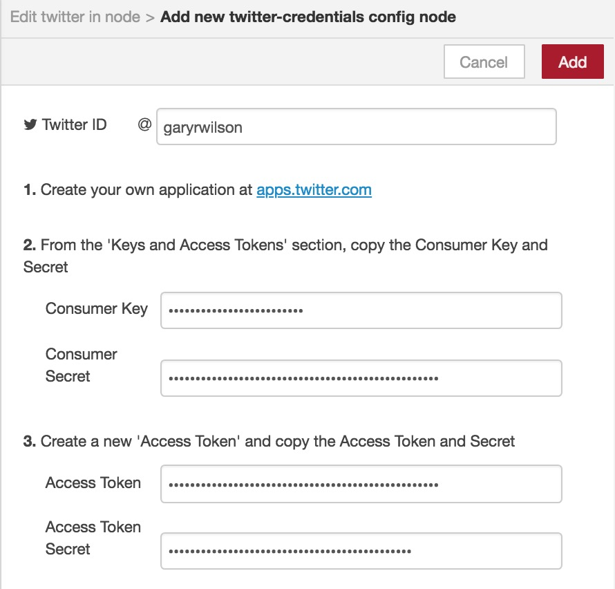
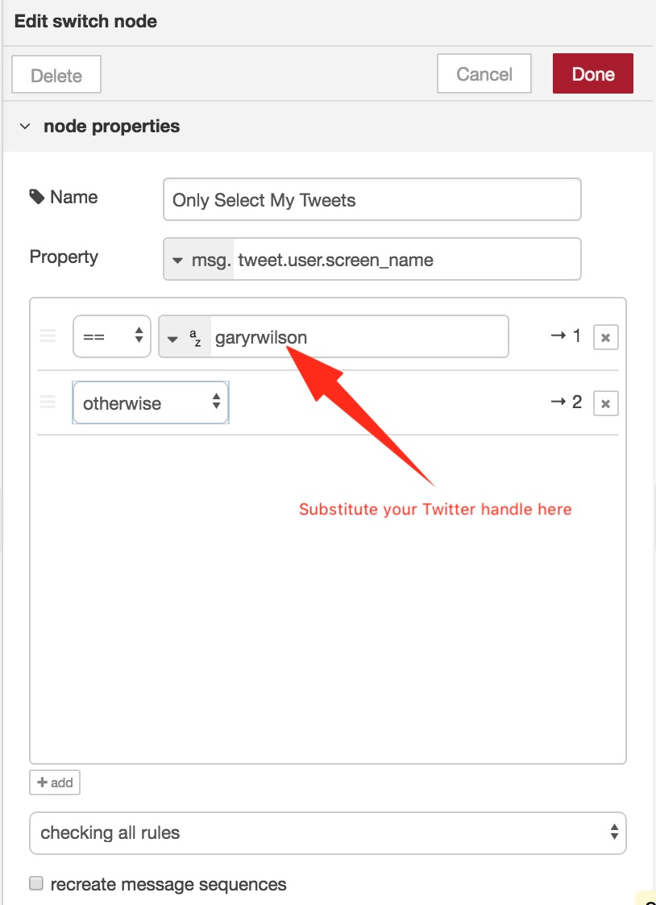
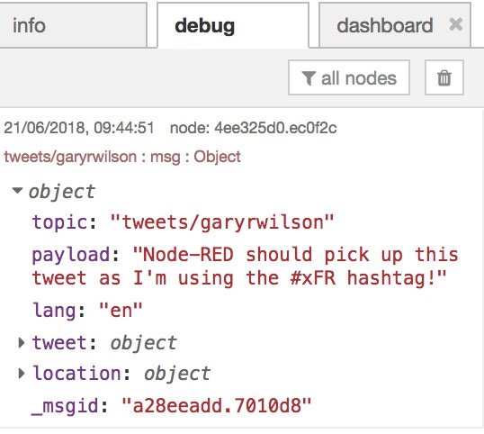

# Cognitive Lab 6: Watson Language Translator
**Watson Language Translator** can _identify_ the language of text and _translate_ it into different languages programmatically, take news from across the globe and present it in your language, communicate with your customers in their own language, and more.

Watson Language Translator uses Neural Machine Translation (NMT) technology - a new machine translation method based on Deep Learning that has led to improvements in translation fluency, achieving higher human evaluations compared to previous technologies. With NMT, developers will see more natural translations between languages at improved speeds and quality.

Here we'll build an application that can automatically translate selected tweets. The Node-RED flow will monitor your personal Twitter feed, look for specific hashtags that indicate a requirement to translate the tweet to a specific language, use Watson Language Translator to perform the translation, and send a new tweet for you in the requested language.

## Requirements
This workshop does not use any of the assets built during previous labs.
The same instance of Node-RED can be used.

## Agenda
- create a Watson Language Translator service within IBM Cloud
- setup a Twitter application so you can use the Twitter API within Node-RED
- use the Twitter node in Node-RED to intercept your personal tweets
- select any personal tweets for translation that have a hashtag `#xYY`
  - x = 'translate', YY = [two-character IETF code](https://console.bluemix.net/docs/services/language-translator/translation-models.html#translation-models) for destination language
- use Watson Language Translator to derive the source language of your tweet
- translate the content of the original tweet into your preferred destination language
- send a new tweet with the translated content

## Setup Watson Language Translator service and a Twitter application
**(1)** Go to the `Catalog` within IBM Cloud and Create a Watson Language Translator service.


**(2)** Connect this service to your Node-RED instance. As well as connecting a service _from_ your Node-RED application, IBM Cloud allows you to connect services _to_ applications.

Select `Connections` and `Create connection`, then select your Node-RED application and `Connect`.


Just use the defaults when asked here and select `Connect & restage app`, then hit `Restage` on the next window.



**(3)** Go to Node-RED, start with a new blank tab, and drop in a `Twitter in` node. If you've already created a Twitter application to use with Node-RED and have the required key and access token, you can skip to step **(7)**.

**(4)** Double-click the `Twitter in` node, and add some new Twitter credentials.



Enter your Twitter handle and follow the link to [apps.twitter.com](apps.twitter.com).



**(5)** On the `Twitter Application Management` page, select `Create New App`.


Enter a name for your application, a description, and a website, then hit `Create your Twitter application`. For the website, we won't have a _'publicly accessible home page'_ for our app, so suggest entering the Watson home page here.



Go to `Keys and Access Tokens` and make a note of your `Consumer Key` and `Consumer Secret`. Then select `Create my access token` and make a note of your `Access Token` and `Access Token Secret`.





**(6)** Go back to Node-RED, complete the `twitter-credentials config node` using these saved details, and hit `Add`.



**(7)** Ensure the `Twitter ID` field in your `Twitter in` node reflects your created credentials, and select `Done`.

## Build the Node-RED Twitter translation application
**(1)** Edit the `Twitter in` node, and add the following into the `for` field:

`#xAR,#xCA,#xCS,#xDA,#xDE,#xEN,#xES,#xFI,#xHI,#xIT,#xFR,#xJA,#xKO,#xNL,#xPL,#xPT,#xRU,#xSV,#xTR,#xZH`

This will ensure that the Twitter node will _only_ pass tweets with any of these listed hashtags to the rest of the flow. What we are doing here is looking for hashtags of the type `#xYY`, where `x` represents a requirement for translation, and `YY` is a two-character IETF language code (e.g. AR = Arabic, DE = German ... ZH = Chinese). The codes above represent the languages that Watson Language Translator can currently perform translation services on. See [here](https://console.bluemix.net/docs/services/language-translator/translation-models.html#translation-models) for full details.


**(2)** Now drop in a `Switch` node and a `Debug` node, changing the `Debug` node to show the `complete msg object`. Edit the `Switch` node so that based on the property `msg.tweet.user.screen_name`, we route to output 1 if the value is **your Twitter handle**, otherwise route to output 2.

This ensures that not only are we catching specific hashtags, but that we'll only process those hashtags if they are one of your own personal tweets.



**(3)** Connect the nodes up and `Deploy`.


Go to Twitter and submit a tweet with one of the hashtags we are looking for, e.g.


You should then see a debug message in Node-RED! Conversely, if you enter a tweet without one of these hashtags, there should be no debug message.



**(4)** Drop in a `Language Identify` node and a `Function` node.

The `Language Identify` node takes the content of the tweet, and passes it to Watson Language Translator which derives the source language of the text - passed on via `msg.lang.language`. The service can identify [these](https://console.bluemix.net/docs/services/language-translator/identifiable-languages.html#identifiable-languages) languages. There's no requirement to change this node.

Call the `Function` node `Find Destination Language & Strip Hashtags`, and use the code below.

First, we are setting `msg.srclang` to the _source language_ identified by the `Language Identify` node, and then we are checking the passed message for each potential hashtag, and setting `msg.destlang` to the appropriate two-character language code - this is where Watson Language Translator is expecting the _destination language_ to be specified.

We're also using the `str.replace` Javascript function here to strip out the hashtag from the original message, so that it's not included in the new translated message.

```javascript
var str = msg.payload;

// Set msg.srclang (for Translation node) to language found by Identify node
msg.srclang = msg.lang.language;

switch (true)
{
   case str.includes("xAR"):
       msg.destlang = "ar";
       str = str.replace(" #xAR", "");
       break;
   case str.includes("xCA"):
       msg.destlang = "ca";
       str = str.replace(" #xCA", "");
       break;
   case str.includes("xCS"):
       msg.destlang = "cs";
       str = str.replace(" #xCS", "");
       break;
   case str.includes("xDA"):
       msg.destlang = "da";
       str = str.replace(" #xDA", "");
       break;
   case str.includes("xDE"):
       msg.destlang = "de";
       str = str.replace(" #xDE", "");
       break;
   case str.includes("xEN"):
       msg.destlang = "en";
       str = str.replace(" #xEN", "");
       break;
   case str.includes("xES"):
       msg.destlang = "es";
       str = str.replace(" #xES", "");
       break;
   case str.includes("xFI"):
       msg.destlang = "fi";
       str = str.replace(" #xFI", "");
       break;
   case str.includes("xFR"):
       msg.destlang = "fr";
       str = str.replace(" #xFR", "");
       break;
   case str.includes("xHI"):
       msg.destlang = "hi";
       str = str.replace(" #xHI", "");
       break;
   case str.includes("xIT"):
       msg.destlang = "it";
       str = str.replace(" #xIT", "");
       break;
   case str.includes("xJA"):
       msg.destlang = "ja";
       str = str.replace(" #xJA", "");
       break;
   case str.includes("xKO"):
       msg.destlang = "ko";
       str = str.replace(" #xKO", "");
       break;
   case str.includes("xNL"):
       msg.destlang = "nl";
       str = str.replace(" #xNL", "");
       break;
   case str.includes("xPL"):
       msg.destlang = "pl";
       str = str.replace(" #xPL", "");
       break;
   case str.includes("xPT"):
       msg.destlang = "pt";
       str = str.replace(" #xPT", "");
       break;
   case str.includes("xRU"):
       msg.destlang = "ru";
       str = str.replace(" #xRU", "");
       break;
   case str.includes("xSV"):
       msg.destlang = "sv";
       str = str.replace(" #xSV", "");
       break;
   case str.includes("xTR"):
       msg.destlang = "tr";
       str = str.replace(" #xTR", "");
       break;
   case str.includes("xZH"):
       msg.destlang = "zh";
       str = str.replace(" #xZH", "");
}

msg.payload = str;
return msg;
```

**(5)** Add a `Language Translator` node, another `Function` node and a `Twitter out` node.

The `Language Translator` node can be left to its default settings, but check the `Twitter out` node so that the `Twitter ID` field reflects your credentials.

**(6)** Call the `Function` node `Send DM If No Translation Model` and paste in this code:
```javascript
// If Watson Language Translator model does not exist, DM Twitter user informing them

if (typeof msg.watsonerror !== 'undefined') {
    msg.payload = "D " + msg.tweet.user.screen_name + " Sorry, Translation Model: " + msg.srclang + "-" + msg.destlang + " is not available via Watson at this time. Check out https://bit.ly/2L325rs to see supported models."
}
return msg;
```

This node checks to see if the `Language Translator` node throws an error - this will happen if we try to call a translation model that Watson doesn't currently support - and sends an informational Twitter Direct Message to the user if appropriate.

Connect up the nodes as below and `Deploy`.


**(7)** Try out your app! If you submit a tweet with any of the hashtags we are looking for, Watson Language Translator will attempt to translate your tweet into the appropriate language and resubmit it. If a translation model doesn't exist, you'll get an informational DM.


The complete flow can be downloaded from [here](./Node-RED/translator.json).

Congratulations! You've reached the end of the **Watson Language Translator** lab, and have now completed the Watson Cognitive Labs!

Over the course of these labs, you've used six Watson cognitive services to build prototype chatbots, visual recognition, text analytics and language translation applications.

If you have any time left, why not try using these experiences and build a prototype based on your own or your client's requirements? Good luck!
